# ORIGEN · Recorrido funcional completo

**Guía de demostración para el jurado · basada exclusivamente en la rama `main` (commit `592fc64`)**

[← Volver al README](README.md) · [Abrir el producto](index.html) · [Ver la especificación](SPEC.md)

## 1. Qué resuelve ORIGEN

ORIGEN es un copiloto de deliberación financiera para analistas de crédito de Colsubsidio. Convierte señales internas y fuentes externas autorizadas en una recomendación trazable sobre cinco dimensiones: producto, monto, condiciones, momento y canal.

La decisión no termina en aprobar o rechazar. El motor compara alternativas y puede recomendar:

- **Viable:** otorgar ahora bajo las condiciones propuestas.
- **Con condiciones:** otorgar con límites o ajustes prudentes.
- **Mejor momento:** esperar una ventana financiera más saludable.
- **Ruta de Bienestar:** no desembolsar hoy y activar acompañamiento.

## 2. Ruta sugerida de demostración (7 minutos)

| Tiempo | Pantalla | Mensaje para el jurado |
|---:|---|---|
| 0:00–0:45 | Bandeja | ORIGEN prioriza 220 casos y protege la PII desde el primer render. |
| 0:45–2:15 | Ficha de afiliado | Cada decisión se explica con fuentes, capacidad, ranking, proyección y canal. |
| 2:15–2:50 | Procesamiento por lote | El mismo motor opera individualmente o sobre archivos de cédulas. |
| 2:50–3:25 | Portafolio y fuentes | Las reglas y la base jurídica son visibles y auditables. |
| 3:25–4:35 | Simulador | Al activar o desactivar fuentes, la decisión se recalcula en tiempo real. |
| 4:35–5:15 | Comparador | Dos personas reciben resoluciones distintas por razones observables. |
| 5:15–6:10 | Laboratorio | El backtest sintético mide protección, inclusión y valor de la data. |
| 6:10–7:00 | Reto y arquitectura | Se cierra mostrando cobertura del reto y viabilidad técnica. |

## 3. Bandeja de decisión

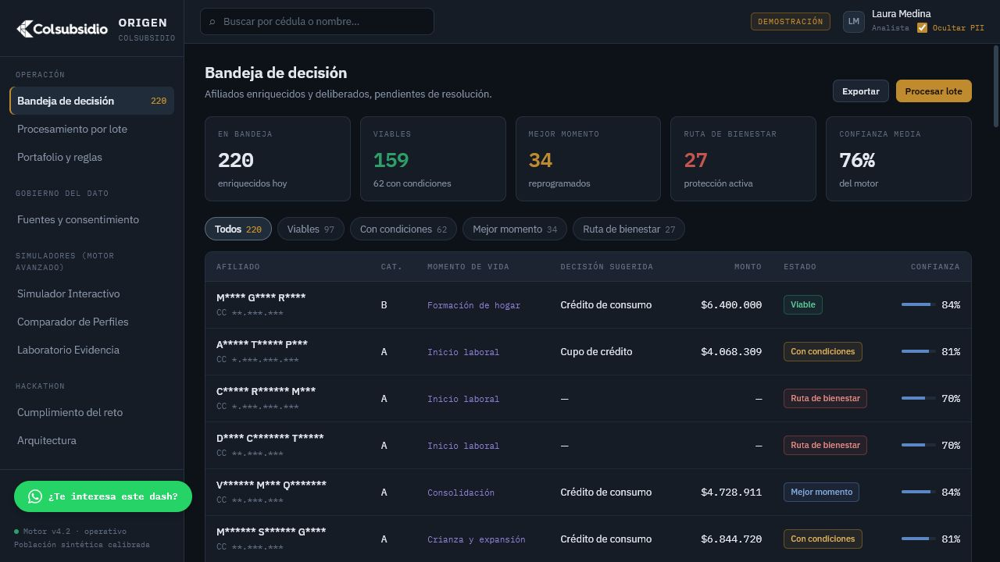

La pantalla inicial concentra la operación diaria:

- 220 perfiles sintéticos enriquecidos y deliberados.
- KPIs de viabilidad, decisiones con condiciones, mejor momento, Ruta de Bienestar y confianza media.
- Filtros por tipo de resolución.
- Tabla con afiliado, categoría, etapa de vida, producto, monto, estado y confianza.
- Buscador por cédula o nombre.
- Exportación y acceso al procesamiento por lote.
- Control `Ocultar PII` activado por defecto para enmascarar nombres y cédulas en la bandeja.

**Qué demostrar:** filtrar por `Ruta de bienestar` y luego abrir un caso viable para contrastar protección e inclusión.

## 4. Ficha explicable del afiliado

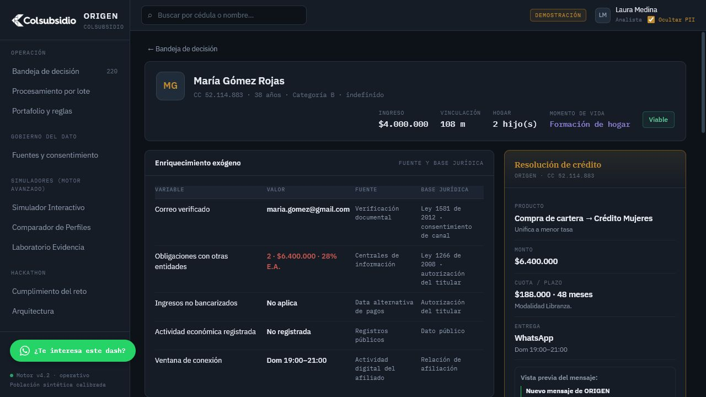

Al seleccionar un caso, ORIGEN abre el expediente de decisión. La ficha reúne:

1. **Contexto del afiliado:** ingreso, vinculación, hogar, categoría y momento de vida.
2. **Enriquecimiento exógeno:** valor, fuente y base jurídica de cada variable.
3. **Capacidad y política:** carga actual, cuota propuesta, disponible, topes y modalidad.
4. **Deliberación del portafolio:** ranking de productos y aportes que forman el puntaje.
5. **Proyección de bienestar:** tres escenarios a 12 meses —otorgar, esperar y acompañar—.
6. **Timing:** mapa de actividad de 7 días por 18 horas para proponer una ventana de contacto.
7. **Resolución:** producto, monto, cuota, plazo, canal, confianza y explicación en lenguaje natural.
8. **Acciones del analista:** aprobar, ajustar condiciones o enviar a Ruta de Bienestar.

**Mensaje clave:** la interfaz permite reconstruir por qué ganó una alternativa y qué productos quedaron detrás; no presenta una respuesta de caja negra.

## 5. Procesamiento por lote

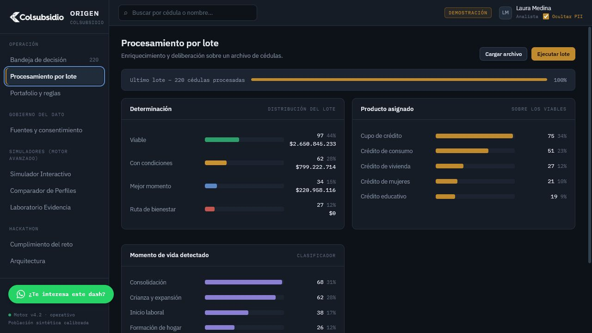

El módulo recibe un archivo de cédulas y simula el enriquecimiento y la deliberación masiva. Resume la distribución del lote por determinación, producto, momento de vida y categoría de afiliación. Los controles `Cargar archivo` y `Ejecutar lote` representan el flujo operativo de entrada y procesamiento.

## 6. Portafolio y reglas

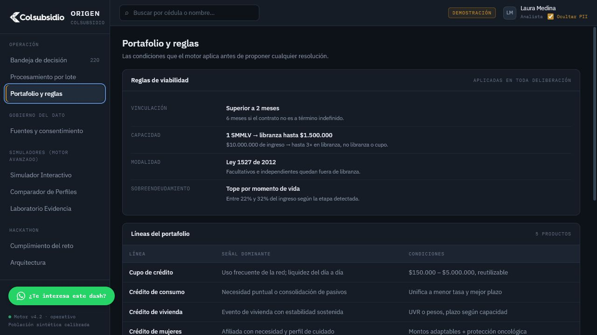

Esta vista hace explícita la política aplicada antes de recomendar: antigüedad mínima, capacidad, modalidad, topes de sobreendeudamiento, señales por producto y parámetros prudentes por etapa de vida. Sirve para que negocio, riesgo y auditoría revisen el mismo conjunto de reglas.

## 7. Fuentes y consentimiento

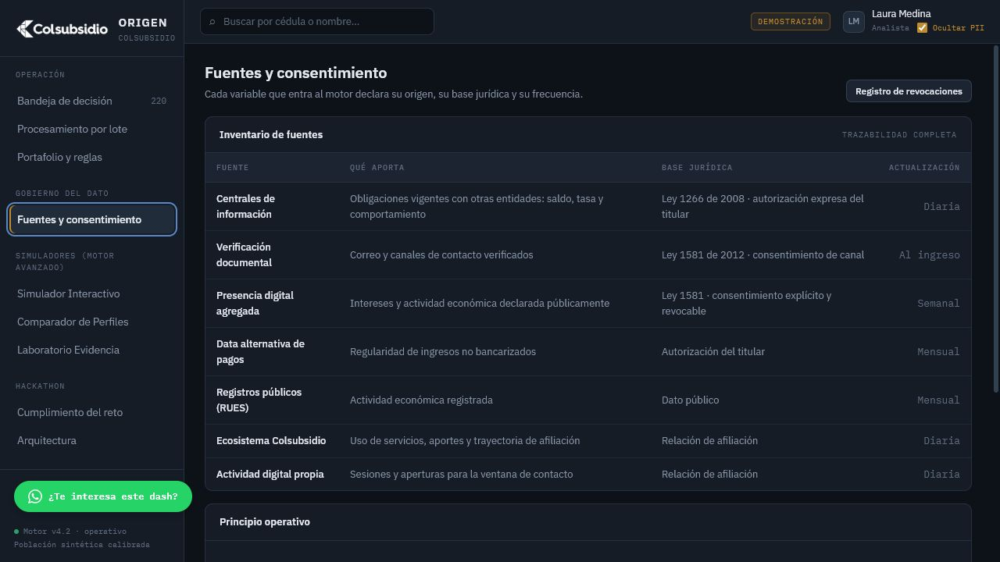

ORIGEN presenta un inventario de fuentes con cuatro elementos auditables: qué aporta, base jurídica o autorización, frecuencia de actualización y uso dentro del motor. El prototipo también expone el principio de revocación: si se retira un consentimiento, las futuras resoluciones deben recalcularse sin la fuente afectada.

## 8. Simulador interactivo

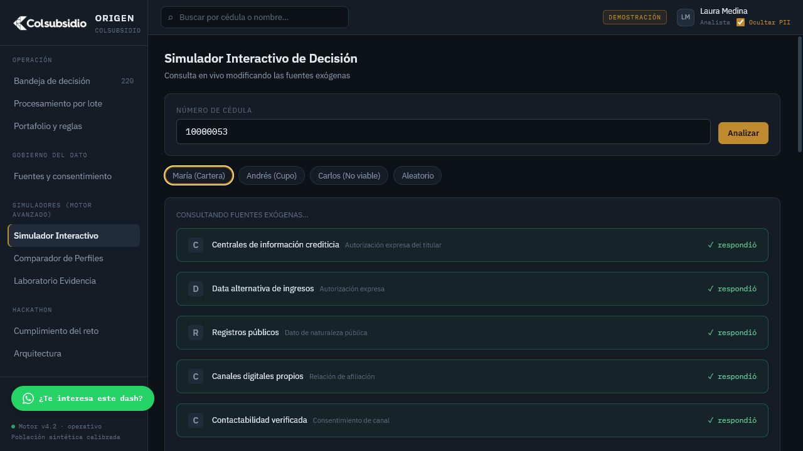

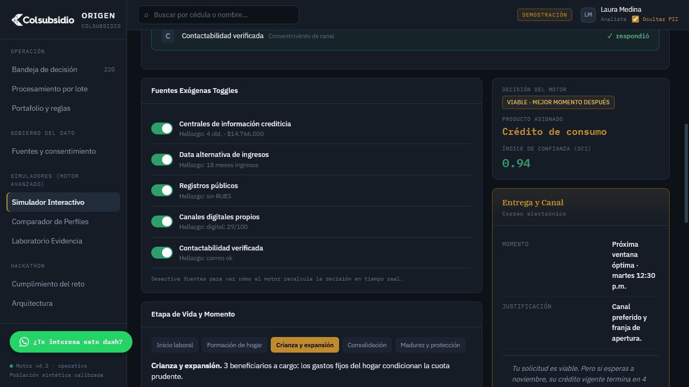

El simulador permite consultar cédulas de demostración y modificar las fuentes exógenas. El recorrido visible incluye:

- Consulta simulada a centrales, data alternativa, registros públicos, canales propios y contactabilidad.
- Interruptores para activar o desactivar fuentes.
- Detección de etapa de vida y momento recomendado.
- Señales ponderadas y alternativas deliberadas.
- Resolución con producto, viabilidad, índice de confianza, canal y próxima ventana.
- Mockup del cierre de venta con desglose de la oferta y desembolso.

**Qué demostrar:** ejecutar `María (Cartera)` y desactivar `Centrales de información crediticia`; el objetivo es mostrar que el insumo y su efecto sobre la decisión son visibles.

## 9. Comparador de perfiles

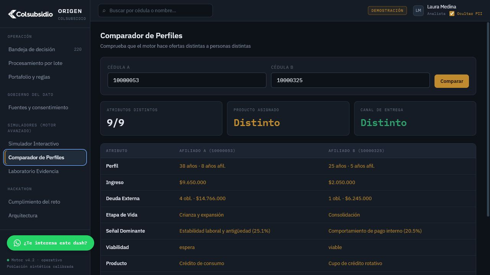

El comparador pone dos cédulas lado a lado y evidencia la hiperpersonalización. Contrasta edad, afiliación, ingreso, deuda externa, etapa de vida, señal dominante, viabilidad, producto, canal, momento e índice DCI. En el caso precargado, los nueve atributos comparados cambian y el motor propone productos y canales distintos.

## 10. Laboratorio de evidencia

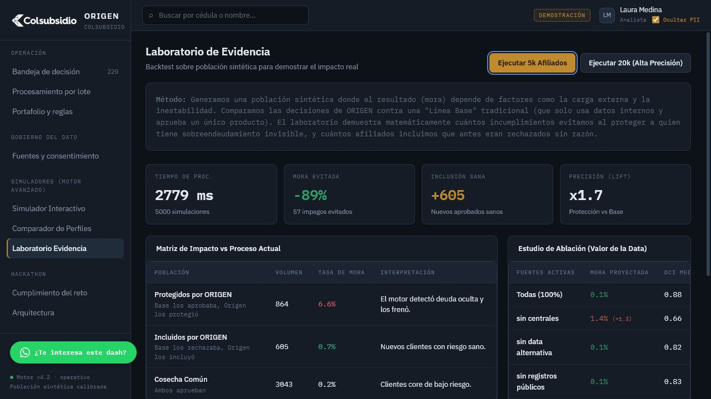

El laboratorio ejecuta 5.000 o 20.000 simulaciones y compara ORIGEN contra una línea base que solo usa datos internos y un producto genérico. Reporta:

- mora evitada y cantidad de impagos protegidos;
- inclusión sana de afiliados que la línea base rechazaba;
- precisión relativa o *lift*;
- pertinencia del producto y aceptación esperada;
- estudio de ablación para medir cuánto cambia la cartera al apagar una fuente.

> Los resultados son evidencia del comportamiento del prototipo sobre población sintética con verdad conocida; no son métricas observadas en cartera real ni una promesa comercial.

## 11. Cumplimiento del reto

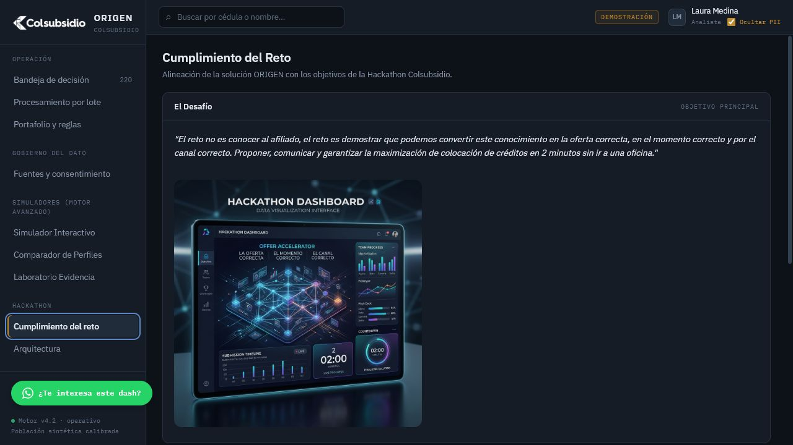

La vista conecta las capacidades del producto con el enunciado del hackathon. Es el cierre funcional para responder al jurado qué requisito atiende cada componente y qué evidencia puede revisar dentro de la demostración.

## 12. Arquitectura

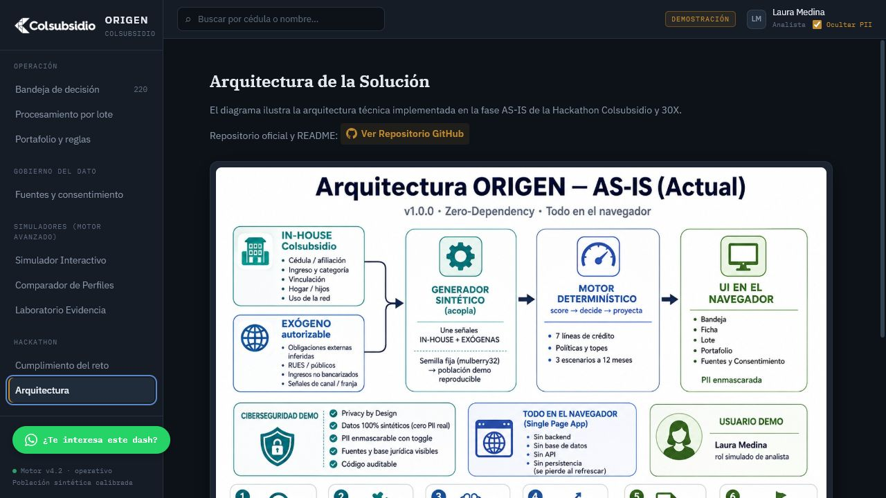

La implementación en `main` es una aplicación de una sola página y cero dependencias de ejecución:

- datos sintéticos internos y fuentes exógenas simuladas;
- generador determinístico que integra señales;
- motor que puntúa, decide y proyecta;
- interfaz en el navegador con bandeja, ficha, lote, portafolio, fuentes y simuladores;
- privacidad demostrativa mediante enmascaramiento de PII;
- sin backend, API, base de datos ni persistencia.

## 13. Cómo ejecutar y validar

### Ejecución directa

1. Descarga o clona el repositorio.
2. Abre `index.html` en un navegador moderno.
3. Mantén activado `Ocultar PII` para la presentación inicial.
4. Sigue la ruta de 7 minutos de este documento.

### Validaciones rápidas antes de presentar

- La bandeja muestra 220 registros y los KPIs cargan sin errores.
- Los filtros actualizan la tabla.
- Una fila abre la ficha completa.
- El simulador completa la consulta de fuentes y presenta una decisión.
- El comparador muestra diferencias entre los dos perfiles precargados.
- El laboratorio termina una corrida de 5.000 afiliados y despliega sus tablas.
- La imagen de arquitectura carga correctamente.

## 14. Alcance responsable

La versión de `main` es un prototipo de demostración. Usa población sintética y simula consultas, consentimientos, notificaciones y desembolsos. Para producción se requieren integraciones autorizadas, seguridad de extremo a extremo, autenticación, persistencia, auditoría, monitoreo, validación de modelos y políticas, pruebas con datos representativos y aprobación de las áreas jurídica, riesgos, privacidad y ciberseguridad.

---

**Equipo:** Jesús Ruiz y Yeisson Abril · Hackathon Colsubsidio y 30X · Julio de 2026
