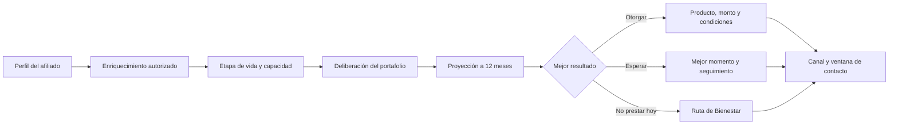

# ORIGEN · Copiloto de Deliberación Financiera

**Reto Crédito Hiperpersonalizado · Hackathon Colsubsidio y 30X · Julio de 2026**

> ORIGEN no pregunta solo cuánto crédito se puede colocar. Ayuda a decidir qué alternativa financiera mejora la vida del afiliado, en qué momento y por qué.

ORIGEN es una estación de decisión para analistas de crédito. Enriquece perfiles, evalúa el portafolio con reglas trazables, proyecta el bienestar financiero a 12 meses y recomienda una resolución: otorgar, otorgar con condiciones, esperar el mejor momento o activar una Ruta de Bienestar.

## Recorrido completo para el jurado

**[Ver el flujo funcional completo, con capturas y guía de demostración →](DOCUMENTATION.md)**

El documento muestra paso a paso la bandeja, la ficha explicable del afiliado, el procesamiento por lote, las reglas, las fuentes y consentimientos, el simulador, el comparador, el laboratorio de evidencia, el cumplimiento del reto y la arquitectura.

## Probar el producto

No requiere instalación, compilación, backend, base de datos ni dependencias de ejecución.

1. Clona o descarga el repositorio.
2. Abre `index.html` en Chrome, Edge, Firefox o Safari.
3. Recorre el menú lateral o selecciona un afiliado de la bandeja.

> La conexión a internet solo mejora la carga de la tipografía y permite abrir enlaces externos; el motor de demostración se ejecuta en el navegador.

### Accesos rápidos

| Recurso | Uso |
|---|---|
| [`index.html`](index.html) | Producto funcional y recorrido principal |
| [`DOCUMENTATION.md`](DOCUMENTATION.md) | Flujo completo explicado para el jurado |
| [`SPEC.md`](SPEC.md) | Especificación funcional del reto |
| [`pitch.html`](pitch.html) | Landing narrativa de la propuesta |

## Qué demuestra ORIGEN

- **Deliberación multiproducto:** compara alternativas y expone el ranking, no solo una aprobación o rechazo.
- **Decisión explicable:** muestra variables, fuentes, reglas de capacidad, composición del puntaje y justificación.
- **Bienestar a 12 meses:** contrasta otorgar ahora, esperar y acompañar para elegir el mejor resultado proyectado.
- **Ruta de Bienestar:** protege al afiliado cuando prestar hoy no es la decisión prudente y programa una nueva evaluación.
- **Hiperpersonalización verificable:** adapta producto, monto, momento y canal al perfil y a su etapa de vida.
- **Privacidad por defecto:** la bandeja inicia con nombre y cédula enmascarados mediante el control `Ocultar PII`.
- **Gobierno del dato:** identifica fuentes, hallazgos, consentimiento o base jurídica y frecuencia de actualización.
- **Evidencia cuantitativa:** ejecuta un backtest sintético, compara contra una línea base y mide protección, inclusión y valor de cada fuente.

## Flujo de decisión

## Arquitectura del prototipo

- HTML5, CSS3 y JavaScript ES6+ en un único `index.html` funcional.
- Generación determinística de población sintética en memoria.
- Gráficos SVG y componentes sin librerías externas de ejecución.
- Datos de demostración: no contiene información real de afiliados.
- Persistencia de demostración: el estado se reinicia al recargar la página.

## Alcance y limitaciones

Este repositorio contiene un prototipo funcional para demostración. Las consultas a fuentes externas, los consentimientos, las notificaciones y los desembolsos se simulan en el navegador; una implementación productiva requeriría integraciones seguras con los sistemas autorizados de Colsubsidio, autenticación, auditoría, cifrado, persistencia y validación normativa.

---

**Equipo:** Jesús Ruiz y Yeisson Abril · Hackathon Colsubsidio y 30X · Julio de 2026
